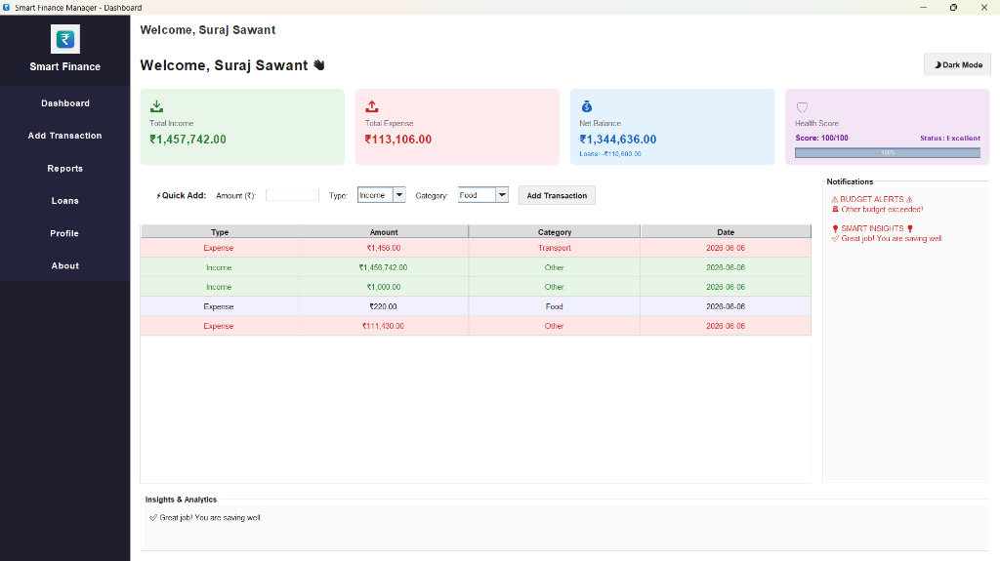
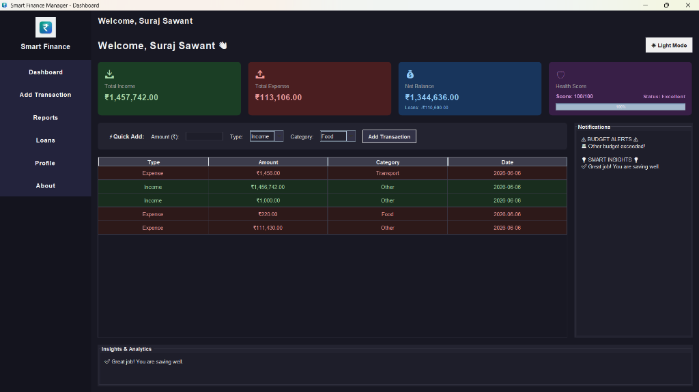
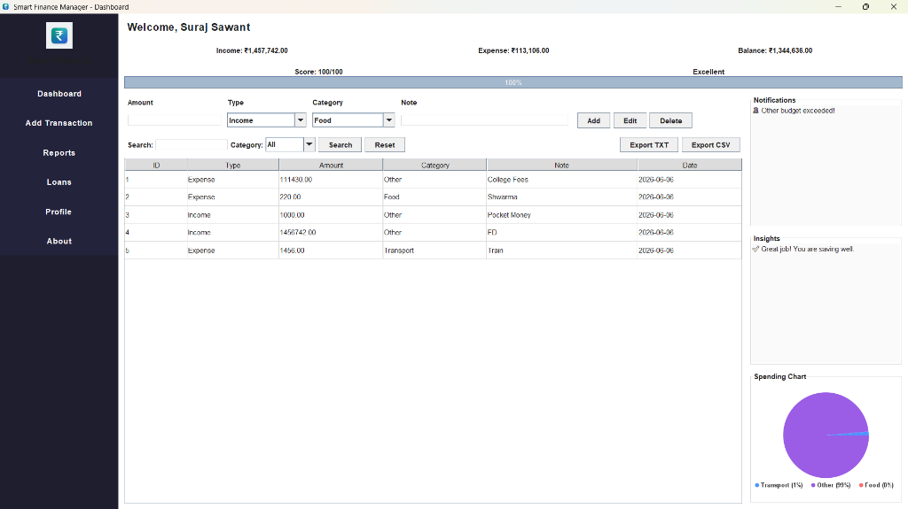
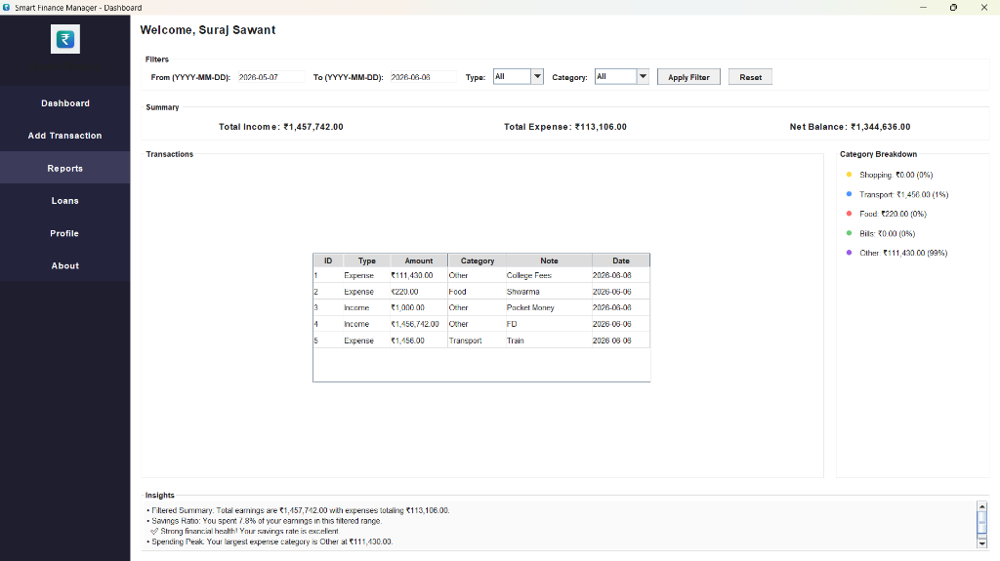
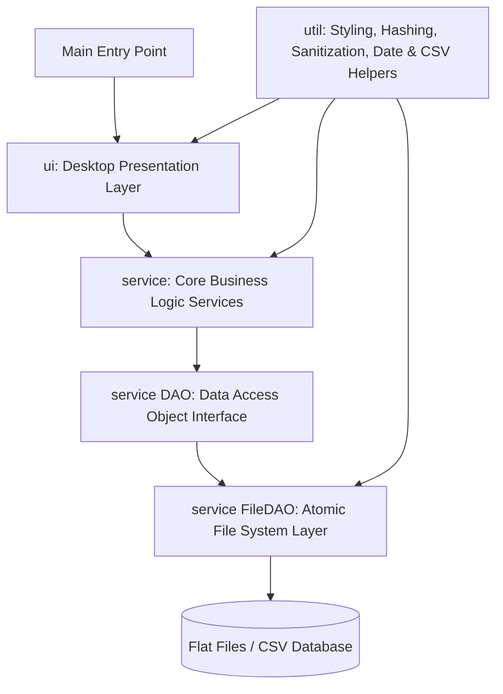

# 💸 Smart Finance Manager

> A modern desktop personal finance companion featuring real-time data analytics, concurrent file-safe persistence, and predictive budget insights.

[](https://oracle.com/java)
[](LICENSE)
[](https://docs.oracle.com/javase/tutorial/uiswing/)

**Smart Finance Manager** is a high-performance, secure, and visually polished desktop application designed to simplify personal wealth management. Engineered with a clean, decoupled Architecture and multi-threaded background task processing, the application ensures real-time UI interactivity while handling secure file persistence, loan management, and multi-language/theme support.

---

## 🎨 Design & Theme Showcase

*To populate the screenshots below, place your screenshots in the `assets/` folder in the root directory.*

| **Light Theme Dashboard** | **Dark Theme Dashboard** |
|:---:|:---:|
|  <br> *Sleek Light Mode* |  <br> *Premium Dark Mode* |

| **Transaction Ledger** | **Analytics & Reports** |
|:---:|:---:|
|  <br> *Ledger & Quick Add* |  <br> *JFreeChart Visualizations* |

---

## 🚀 Key Features

*   **📊 Dynamic Fintech Dashboard:**
    *   Solid, rounded summary cards displaying real-time Income, Expenses, Net Balance, and financial Health Scores.
    *   Custom JTable renderers with soft color highlighting for transaction types and interactive cursor hover highlights.
    *   Auto-populated empty state placeholder views when there is no ledger history.
*   **📥 Transaction Ledger:**
    *   Support for adding, updating, and deleting transactions with dynamic category/type mappings.
    *   Responsive list selection listeners that automatically load row data back into text inputs for quick edits.
*   **🤝 Loan & Debt Tracker:**
    *   Separate categorizations for money given and taken.
    *   Visual progress tracking of partial payments and one-click settlements.
*   **🔔 Budget Tracking & Warnings:**
    *   Set custom spending thresholds per category (Food, Transport, Bills, Shopping, etc.).
    *   Auto-generated visual warnings and notifications if current spending exceeds set limits.
*   **🌓 Adaptive Theming (Light/Dark Mode):**
    *   Seamless runtime switching between light and dark themes using custom component-level look-and-feel bindings.
*   **🔒 Cryptographically Secure Authentication:**
    *   PBKDF2 password hashing utilizing PBKDF2WithHmacSHA256 with cryptographically secure salts.
    *   Backward compatibility to securely upgrade legacy MD5/SHA-256 passwords upon user login.
*   **⚙️ Multi-Threaded Concurrency (EDT Safe):**
    *   Background data loading, file reading, and data processing via `SwingWorker` threads to ensure the UI remains fully responsive.
*   **💾 Atomic File Persistence:**
    *   Data updates write to `.tmp` files first and use atomic operations to replace the database text files, preventing file corruption in case of unexpected system crashes.

---

## 🛠️ Tech Stack

*   **Language:** Java (JDK 17+)
*   **UI Toolkit:** Java Swing (built-in look-and-feel customization)
*   **Charts & Visualization:** JFreeChart (1.5.3) & JCommon (1.0.24)
*   **Persistence:** Plain-text / CSV flat files (Data-Safe Write Engine)
*   **Security:** Java Cryptography Architecture (JCA) for PBKDF2 hashing

---

## 📐 Project Architecture

The codebase implements a strict **Decoupled Three-Tier Architecture** to separate user interaction, business rules, and file operations without utilizing external frameworks like Spring:



### Module Descriptions:
*   **`model`**: Defines pure domain models (e.g., `User`, `Transaction`, `Loan`, `Budget`, `Goal`) with CSV serialization support.
*   **`service`**: Coordinates application business logic (e.g., calculations, alerts, insights) and maintains in-memory service caches.
*   **`service (DAO)`**: Abstraction interfaces and file-based implementation layers (e.g., `FileLoanDAO`, `FileBudgetDAO`) utilizing `ReentrantReadWriteLock` for concurrent read/write thread safety.
*   **`ui`**: Presentation modules, JFrames, custom JPanels, custom JTable cell renderers, and mouse gesture listeners.
*   **`util`**: Utility classes for string sanitization, theme toggling, cryptography, CSV parsing, and system-wide logging.

---

## 💻 Installation & Setup

Choose one of the following methods to install and run the Smart Finance Manager:

### Prerequisites:
*   **Java Development Kit (JDK 17 or higher)** installed.
*   An IDE (IntelliJ IDEA, Eclipse, or NetBeans) — *only if building/running from source*.

---

### Option A: Run Pre-built Executable JAR (Quick Start)
The easiest way to run the application is to use the self-contained executable JAR which bundles all classes, resources, and external libraries.

1.  Clone the repository or download `SmartFinanceManager.jar`.
2.  Open your terminal in the directory containing `SmartFinanceManager.jar` and run:
    ```bash
    java -jar SmartFinanceManager.jar
    ```

---

### Option B: Build & Run from Source (IDE)

1.  **Clone the Repository:**
    ```bash
    git clone https://github.com/daystar-1nine/SmartFinanceManager.git
    cd SmartFinanceManager
    ```

2.  **Import to IDE (IntelliJ IDEA Recommended):**
    *   Open IntelliJ IDEA, select **Open**, and navigate to the cloned directory.
    *   Verify that the Project Structure SDK is set to **JDK 17+**.

3.  **Configure Libraries (JFreeChart):**
    *   Ensure the JAR files in `libs/` (`jfreechart-1.5.3.jar` and `jcommon-1.0.24.jar`) are added as project dependencies.
    *   In IntelliJ: Right-click the `libs/` directory -> **Add as Library...**

4.  **Run the Application:**
    *   Locate the file `src/main/Main.java`.
    *   Right-click `Main.java` and select **Run 'Main.main()'**.

---

### Option C: Build the Self-Contained JAR Locally

If you want to package the source code into the self-contained `SmartFinanceManager.jar` yourself:

1.  Compile the source code:
    ```bash
    javac -Xlint:all -cp "SmartFinanceManager/libs/*" -d out @sources.txt
    ```
2.  Run the build script to pack classes, resources, and dependencies:
    ```powershell
    # Windows PowerShell
    powershell -ExecutionPolicy Bypass -File C:\Users\suraj\.gemini\antigravity\brain\70af736d-f304-401c-957c-1cec72b272a6\scratch\build_jar.ps1
    ```

---

## 📖 Usage Guide

*   **Signup & Login:** Launch the app, navigate to the Signup Frame to register a new user, and log in.
*   **Dashboard Overview:** View your total income, expenditures, current wallet balance, and interactive JFreeChart pie chart representing categories.
*   **Record Transactions:** Navigate to **Add Transaction** to input new ledger records. Fill in Amount, Type, Category, and click Quick Add. Selecting a row in the table will populate it back into the editor for instant updates.
*   **Track Debts:** Head to the **Loans** panel to log money given or taken, apply payments, and view overall remaining balances.
*   **Generate Reports:** Navigate to **Reports** to review date range filters and visualize spending distributions.

---

## 🛡️ Advanced Engineering & Security Details

*   **Atomic Write Transactions:** To avoid corrupted data blocks during file I/O operations, writing transactions/loans first generates a temporary `.tmp` file. Once writing completes, `java.nio.file.Files.move` swaps it with the production database file using an atomic move operation (`ATOMIC_MOVE`).
*   **Credential Protection in JVM Heap Memory:** Passwords are captured and stored in memory using `char[]` instead of strings. Immediately after verification/hashing, `java.util.Arrays.fill(passArray, '0')` wipes the byte values, neutralizing memory dumping attacks on the JVM heap.
*   **Concurrency Safe Caches:** Services hold in-memory user-specific hashes and values. Multi-threaded access to underlying data files is isolated using `ReentrantReadWriteLock` to allow concurrent reading while maintaining strict sequential write consistency.
*   **Global Sanitization Pipeline:** User input is processed through a CSV sanitization utility (`CSVUtil`) that strips raw comma sequences, preventing CSV injection and database structure breakage.

---

## 🔮 Future Roadmap

*   [ ] **Database Migration:** Swap the local flat files for an embedded SQLite database engine.
*   [ ] **Cloud Backup:** Integrate a secure REST client for optional cloud backup and sync.
*   [ ] **Budget Forecasting:** Implement linear regression models to predict future month expenditures based on history.
*   [ ] **Cross-Platform Mobile App:** Extend the application logic using Java-based frameworks for mobile support.

---

## 👥 The Engineering Team

| **Suraj Sawant** <br> (Team Lead) | **Shubhra Shinde** <br> (UI Developer) | **Aditi Patil** <br> (Core Logic) | **Sharwani Kudu** <br> (Testing & QA) |
|:---:|:---:|:---:|:---:|
| [GitHub](https://github.com/daystar-1nine) <br> [LinkedIn](https://www.linkedin.com/in/surajsawant19062005/) | [GitHub](https://github.com/shubhrashinde) <br> [LinkedIn](https://www.linkedin.com/in/shubhra-shinde-aab746403/) | [GitHub](https://github.com/aditi22builds) <br> [LinkedIn](https://www.linkedin.com/in/aditi-patil-888560414/) | [GitHub](https://github.com/shrawani3007) <br> [LinkedIn](https://www.linkedin.com/in/shrawani-kudu-212767393/) |

---

## 📄 License

Distributed under the MIT License. See `LICENSE` for more information.

---
*Developed for educational purposes as part of the Java Internship Program.*
